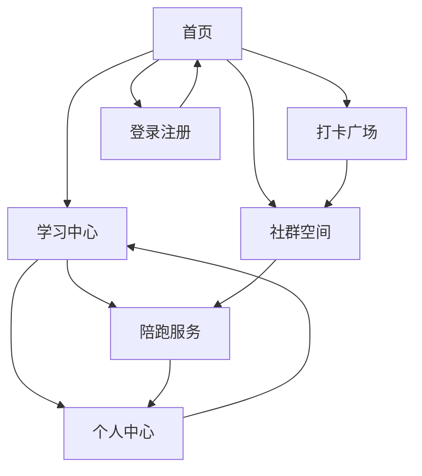

# 新手开发陪跑器 - 产品需求文档

## 1. 产品概述
新手开发陪跑器是一个专为编程初学者设计的学习陪伴平台，通过任务分解、实时陪跑、社群鼓励等方式，帮助用户克服学习困难，提高学习坚持度。
- 解决编程学习中的孤独感、缺乏方向感和难以坚持的问题，为初学者、转型人群和高校学生提供系统化的学习支持。
- 目标成为国内领先的编程学习陪伴平台，服务10万+编程学习者。

## 2. 核心功能

### 2.1 用户角色
| 角色 | 注册方式 | 核心权限 |
|------|----------|----------|
| 免费用户 | 微信/邮箱注册 | 基础学习资源、社群参与、打卡功能 |
| 会员用户 | 付费订阅升级 | 完整课程、个性化辅导、专属社群 |
| 陪跑导师 | 邀请制认证 | 发布课程、一对一辅导、收益分成 |

### 2.2 功能模块
我们的新手开发陪跑器包含以下主要页面：
1. **首页**：产品介绍、学习路径推荐、热门课程展示、用户成功案例
2. **学习中心**：课程列表、学习进度、任务分解、实时反馈
3. **打卡广场**：学习打卡、进度分享、同伴互动、激励排行
4. **社群空间**：学习讨论、问题求助、经验分享、导师答疑
5. **个人中心**：学习数据、成长轨迹、会员服务、设置管理
6. **陪跑服务**：一对一辅导预约、导师匹配、实时沟通
7. **登录注册**：用户认证、微信登录、邮箱注册

### 2.3 页面详情
| 页面名称 | 模块名称 | 功能描述 |
|----------|----------|----------|
| 首页 | 产品介绍区 | 展示平台价值主张、核心功能亮点、用户成功故事 |
| 首页 | 学习路径推荐 | 根据用户背景推荐适合的学习路径、显示学习时长和难度 |
| 首页 | 热门课程展示 | 展示热门课程、用户评价、课程简介和价格信息 |
| 学习中心 | 课程管理 | 浏览课程、加入学习、查看进度、下载资料 |
| 学习中心 | 任务分解系统 | 将复杂项目分解为小任务、设置里程碑、跟踪完成状态 |
| 学习中心 | 实时反馈 | AI智能答疑、代码检查、学习建议、错误纠正 |
| 打卡广场 | 学习打卡 | 每日学习记录、上传学习成果、添加学习心得 |
| 打卡广场 | 社交互动 | 点赞评论、关注好友、学习小组、挑战活动 |
| 打卡广场 | 激励排行 | 学习时长排行、打卡天数统计、成就徽章展示 |
| 社群空间 | 讨论区 | 技术讨论、问题求助、经验分享、学习资源推荐 |
| 社群空间 | 导师答疑 | 专业导师在线答疑、定期直播、技术分享 |
| 个人中心 | 学习数据 | 学习时长统计、知识点掌握度、学习轨迹可视化 |
| 个人中心 | 会员服务 | 订阅管理、特权展示、续费提醒、客服联系 |
| 陪跑服务 | 导师匹配 | 根据学习需求匹配合适导师、查看导师资料和评价 |
| 陪跑服务 | 预约系统 | 预约一对一辅导、选择时间、确认服务内容 |
| 陪跑服务 | 实时沟通 | 视频通话、屏幕共享、代码协作、学习记录 |
| 登录注册 | 用户认证 | 微信快捷登录、邮箱注册、密码找回、账号绑定 |

## 3. 核心流程

**新用户学习流程：**
用户注册登录 → 选择学习路径 → 加入课程 → 任务分解学习 → 每日打卡分享 → 社群互动交流 → 遇到问题求助 → 考虑升级会员获得更多服务

**会员用户深度学习流程：**
会员登录 → 访问专属课程 → 预约一对一陪跑 → 导师实时指导 → 完成项目实战 → 获得认证证书 → 分享学习成果

**导师服务流程：**
导师登录 → 查看学员预约 → 准备辅导内容 → 进行一对一指导 → 记录学习进度 → 获得服务收益

## 4. 用户界面设计

### 4.1 设计风格
- **主色调：**温暖橙色(#FF6B35)作为主色，代表活力和陪伴；辅助色为清新蓝色(#4A90E2)，传达专业和信任
- **按钮样式：**圆角矩形按钮，具有轻微阴影效果，点击时有微动画反馈
- **字体：**主标题使用苹方/微软雅黑 18-24px，正文使用14-16px，确保清晰易读
- **布局风格：**卡片式设计，顶部导航栏，左侧功能菜单，主内容区域采用网格布局
- **图标风格：**线性图标配合填充图标，使用温暖色调，支持学习、成长、陪伴等主题

### 4.2 页面设计概览

| 页面名称 | 模块名称 | UI元素 |
|----------|----------|--------|
| 首页 | 产品介绍区 | 大背景图、渐变色叠加、白色大标题、橙色CTA按钮、用户头像轮播 |
| 首页 | 学习路径推荐 | 卡片式布局、进度条显示、难度星级、预计时长标签、立即开始按钮 |
| 学习中心 | 课程管理 | 列表+网格切换视图、课程封面图、进度环形图、标签分类、搜索筛选 |
| 学习中心 | 任务分解系统 | 树状结构图、复选框、进度条、时间轴、里程碑标记 |
| 打卡广场 | 学习打卡 | 时间轴布局、图片上传区、文字编辑器、话题标签、发布按钮 |
| 打卡广场 | 激励排行 | 排行榜列表、用户头像、数据可视化图表、徽章展示、分享按钮 |
| 社群空间 | 讨论区 | 论坛式布局、帖子卡片、用户头像、回复层级、点赞收藏按钮 |
| 陪跑服务 | 导师匹配 | 导师卡片、星级评价、专业标签、预约按钮、价格显示 |
| 个人中心 | 学习数据 | 仪表盘布局、环形图表、折线图、数据卡片、成就展示区 |

### 4.3 响应式设计
采用移动优先的响应式设计，支持手机、平板、桌面端多设备适配。移动端优化触摸交互，桌面端提供更丰富的功能展示。