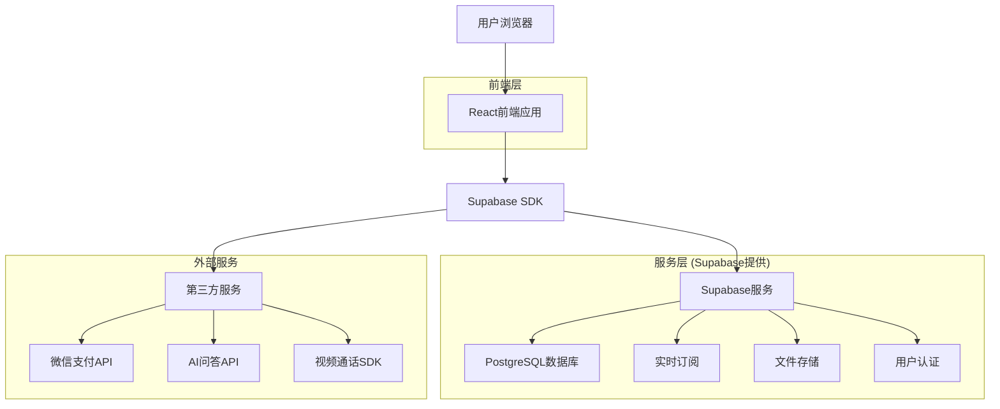
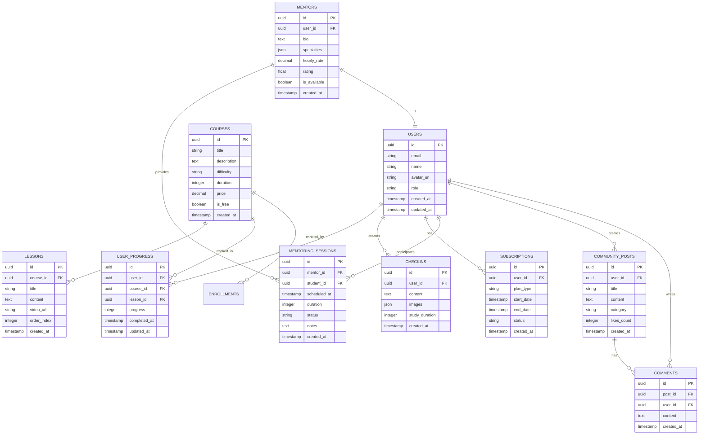

# 新手开发陪跑器 - 技术架构文档

## 1. 架构设计



## 2. 技术描述

* **前端：** React\@18 + TypeScript + Tailwind CSS + Vite + React Router

* **后端：** Supabase (提供数据库、认证、实时功能、文件存储)

* **状态管理：** Zustand

* **UI组件库：** Ant Design + 自定义组件

* **实时通信：** Supabase Realtime + WebRTC (视频通话)

* **支付集成：** 微信支付API

* **AI服务：** OpenAI API / 百度文心一言API

## 3. 路由定义

| 路由                            | 用途             |
| ----------------------------- | -------------- |
| /                             | 首页，展示产品介绍和核心功能 |
| /login                        | 登录页面，支持微信和邮箱登录 |
| /register                     | 注册页面，用户账号创建    |
| /learning                     | 学习中心，课程管理和学习进度 |
| /learning/:courseId           | 具体课程详情和学习界面    |
| /checkin                      | 打卡广场，学习打卡和社交互动 |
| /community                    | 社群空间，讨论区和问答    |
| /community/:topicId           | 具体讨论话题详情页      |
| /mentoring                    | 陪跑服务，导师匹配和预约   |
| /mentoring/session/:sessionId | 一对一辅导会话页面      |
| /profile                      | 个人中心，用户信息和学习数据 |
| /profile/subscription         | 会员订阅管理页面       |
| /admin                        | 管理后台，导师和内容管理   |

## 4. API定义

### 4.1 核心API

**用户认证相关**

```
POST /auth/v1/signup
```

请求参数：

| 参数名      | 参数类型   | 是否必需 | 描述   |
| -------- | ------ | ---- | ---- |
| email    | string | true | 用户邮箱 |
| password | string | true | 用户密码 |
| name     | string | true | 用户姓名 |

响应参数：

| 参数名     | 参数类型   | 描述     |
| ------- | ------ | ------ |
| user    | object | 用户信息对象 |
| session | object | 会话信息   |

**课程管理相关**

```
GET /rest/v1/courses
```

响应参数：

| 参数名         | 参数类型    | 描述         |
| ----------- | ------- | ---------- |
| id          | uuid    | 课程ID       |
| title       | string  | 课程标题       |
| description | string  | 课程描述       |
| difficulty  | string  | 难度等级       |
| duration    | integer | 预计学习时长(小时) |
| price       | decimal | 课程价格       |

**学习进度相关**

```
POST /rest/v1/user_progress
```

请求参数：

| 参数名        | 参数类型    | 是否必需 | 描述          |
| ---------- | ------- | ---- | ----------- |
| user\_id   | uuid    | true | 用户ID        |
| course\_id | uuid    | true | 课程ID        |
| lesson\_id | uuid    | true | 课时ID        |
| progress   | integer | true | 完成进度(0-100) |

**打卡记录相关**

```
POST /rest/v1/checkins
```

请求参数：

| 参数名             | 参数类型    | 是否必需  | 描述       |
| --------------- | ------- | ----- | -------- |
| user\_id        | uuid    | true  | 用户ID     |
| content         | text    | true  | 打卡内容     |
| images          | array   | false | 图片URL数组  |
| study\_duration | integer | true  | 学习时长(分钟) |

## 5. 数据模型

### 5.1 数据模型定义



### 5.2 数据定义语言

**用户表 (users)**

```sql
-- 创建用户表
CREATE TABLE users (
    id UUID PRIMARY KEY DEFAULT gen_random_uuid(),
    email VARCHAR(255) UNIQUE NOT NULL,
    name VARCHAR(100) NOT NULL,
    avatar_url TEXT,
    role VARCHAR(20) DEFAULT 'student' CHECK (role IN ('student', 'mentor', 'admin')),
    created_at TIMESTAMP WITH TIME ZONE DEFAULT NOW(),
    updated_at TIMESTAMP WITH TIME ZONE DEFAULT NOW()
);

-- 权限设置
GRANT SELECT ON users TO anon;
GRANT ALL PRIVILEGES ON users TO authenticated;
```

**课程表 (courses)**

```sql
-- 创建课程表
CREATE TABLE courses (
    id UUID PRIMARY KEY DEFAULT gen_random_uuid(),
    title VARCHAR(200) NOT NULL,
    description TEXT,
    difficulty VARCHAR(20) CHECK (difficulty IN ('beginner', 'intermediate', 'advanced')),
    duration INTEGER, -- 预计学习时长(小时)
    price DECIMAL(10,2) DEFAULT 0,
    is_free BOOLEAN DEFAULT false,
    cover_image_url TEXT,
    created_at TIMESTAMP WITH TIME ZONE DEFAULT NOW()
);

-- 权限设置
GRANT SELECT ON courses TO anon;
GRANT ALL PRIVILEGES ON courses TO authenticated;
```

**课时表 (lessons)**

```sql
-- 创建课时表
CREATE TABLE lessons (
    id UUID PRIMARY KEY DEFAULT gen_random_uuid(),
    course_id UUID REFERENCES courses(id) ON DELETE CASCADE,
    title VARCHAR(200) NOT NULL,
    content TEXT,
    video_url TEXT,
    order_index INTEGER NOT NULL,
    created_at TIMESTAMP WITH TIME ZONE DEFAULT NOW()
);

-- 创建索引
CREATE INDEX idx_lessons_course_id ON lessons(course_id);
CREATE INDEX idx_lessons_order ON lessons(course_id, order_index);

-- 权限设置
GRANT SELECT ON lessons TO anon;
GRANT ALL PRIVILEGES ON lessons TO authenticated;
```

**学习进度表 (user\_progress)**

```sql
-- 创建学习进度表
CREATE TABLE user_progress (
    id UUID PRIMARY KEY DEFAULT gen_random_uuid(),
    user_id UUID REFERENCES users(id) ON DELETE CASCADE,
    course_id UUID REFERENCES courses(id) ON DELETE CASCADE,
    lesson_id UUID REFERENCES lessons(id) ON DELETE CASCADE,
    progress INTEGER DEFAULT 0 CHECK (progress >= 0 AND progress <= 100),
    completed_at TIMESTAMP WITH TIME ZONE,
    updated_at TIMESTAMP WITH TIME ZONE DEFAULT NOW()
);

-- 创建索引
CREATE INDEX idx_user_progress_user_id ON user_progress(user_id);
CREATE INDEX idx_user_progress_course_id ON user_progress(course_id);
CREATE UNIQUE INDEX idx_user_progress_unique ON user_progress(user_id, lesson_id);

-- 权限设置
GRANT ALL PRIVILEGES ON user_progress TO authenticated;
```

**打卡记录表 (checkins)**

```sql
-- 创建打卡记录表
CREATE TABLE checkins (
    id UUID PRIMARY KEY DEFAULT gen_random_uuid(),
    user_id UUID REFERENCES users(id) ON DELETE CASCADE,
    content TEXT NOT NULL,
    images JSON, -- 存储图片URL数组
    study_duration INTEGER DEFAULT 0, -- 学习时长(分钟)
    likes_count INTEGER DEFAULT 0,
    created_at TIMESTAMP WITH TIME ZONE DEFAULT NOW()
);

-- 创建索引
CREATE INDEX idx_checkins_user_id ON checkins(user_id);
CREATE INDEX idx_checkins_created_at ON checkins(created_at DESC);

-- 权限设置
GRANT SELECT ON checkins TO anon;
GRANT ALL PRIVILEGES ON checkins TO authenticated;
```

**订阅表 (subscriptions)**

```sql
-- 创建订阅表
CREATE TABLE subscriptions (
    id UUID PRIMARY KEY DEFAULT gen_random_uuid(),
    user_id UUID REFERENCES users(id) ON DELETE CASCADE,
    plan_type VARCHAR(20) NOT NULL CHECK (plan_type IN ('monthly', 'yearly')),
    start_date TIMESTAMP WITH TIME ZONE NOT NULL,
    end_date TIMESTAMP WITH TIME ZONE NOT NULL,
    status VARCHAR(20) DEFAULT 'active' CHECK (status IN ('active', 'expired', 'cancelled')),
    created_at TIMESTAMP WITH TIME ZONE DEFAULT NOW()
);

-- 创建索引
CREATE INDEX idx_subscriptions_user_id ON subscriptions(user_id);
CREATE INDEX idx_subscriptions_status ON subscriptions(status);

-- 权限设置
GRANT ALL PRIVILEGES ON subscriptions TO authenticated;
```

**初始化数据**

```sql
-- 插入示例课程数据
INSERT INTO courses (title, description, difficulty, duration, price, is_free) VALUES
('JavaScript基础入门', '从零开始学习JavaScript编程语言基础知识', 'beginner', 40, 199.00, false),
('React开发实战', '学习React框架开发现代Web应用', 'intermediate', 60, 299.00, false),
('编程思维训练', '培养编程逻辑思维和问题解决能力', 'beginner', 20, 0.00, true);

-- 插入示例课时数据
INSERT INTO lessons (course_id, title, content, order_index) 
SELECT 
    c.id,
    '第' || generate_series(1, 10) || '课：' || c.title || '基础知识',
    '这是第' || generate_series(1, 10) || '课的详细内容...',
    generate_series(1, 10)
FROM courses c WHERE c.title = 'JavaScript基础入门';
```

